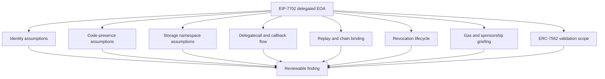

# ChainEDR Analyzer

**Static security analysis for Pectra-era smart accounts: EIP-7702 delegated accounts, ERC-4337 account abstraction, and ERC-7562 validation boundaries.**

ChainEDR is not a generic "find every Solidity bug" scanner. Its strongest value is narrower and more defensible: it models assumptions that changed after EIP-7702, then turns suspicious code patterns into reviewable evidence for security engineers.

Status: **private-beta research prototype**. Use it for authorized audits, internal review, benchmark research, contest preparation, and security-engineering feedback. Do not treat a finding as an automatically confirmed exploit.

The repository is intentionally narrow. The runtime / EDR / fuzzing / on-chain-monitor research directions were removed in the 10/10-beta cleanup sweep. Everything that ships is on the v3 CLI path:

```
chainedr scan / ci / prove / doctor / watch
```

Production readiness is tracked in
[`docs/PRODUCTION_READINESS.md`](docs/PRODUCTION_READINESS.md). The short
version: this is a research prototype useful for auditors and Pectra-era
research now; public production-ready claims still require deeper AST /
call-graph work, a larger blind external benchmark, and an external review.

If you are reviewing this as an external security researcher, start with
[`docs/AUDITOR_BETA_START.md`](docs/AUDITOR_BETA_START.md), then
[`REVIEWER_BRIEF.md`](REVIEWER_BRIEF.md). These give the shortest honest path
through the repo, including how to run the beta, how to judge outputs, what is
strong, what is weak, and which claims are not being made.


---

## Why This Exists

EIP-7702 lets an externally owned account temporarily delegate code execution to a contract. That is powerful, but it breaks old Solidity assumptions:

- `tx.origin == msg.sender` no longer proves "plain human EOA".
- `address.code.length == 0` no longer proves "not executing contract logic".
- ETH sent to an EOA may now interact with delegated code.
- Delegation targets can create new storage, replay, revocation, gas, and validation-scope risks.

Most existing Solidity scanners are strong on older vulnerability families: reentrancy, unchecked calls, access control, arithmetic, proxy mistakes, and generic code smells. ChainEDR focuses on the newer **delegated-account boundary** and produces artifacts that can be reviewed, reproduced, and converted into paper-grade evaluation.

---

## What It Competes With

The honest comparison set is:

- Slither;
- Semgrep Solidity rules;
- CodeQL queries;
- Aderyn;
- Mythril-style symbolic analysis;
- custom Solidity audit scripts;
- ERC-4337 validation checkers.

ChainEDR Analyzer's wedge is narrower:

> What old assumptions become unsafe after an EOA can execute delegated code?

That is where the tool should be judged. It is not trying to replace broad audit suites. It is trying to be sharper on post-Pectra EOA, signature, validation, storage, and delegated-execution assumptions.

---

## What Has Been Built

Current repository state includes:

- **30 core checks** (benchmark-validated) + **19 extended checks** (newer, not yet FP-tuned)
  - 21 EIP-7702 delegated-account checks (core).
  - 9 ERC-7562 validation-sandbox checks (core).
  - **Opt-in** (`chainedr scan --extended`): 5 extended EIP-7702 (AA7702-022→026), 5 ERC-7821
    batch-executor, 5 ERC-6900 modular-account, 4 MEV checks. **Off by default** — they add coverage but
    are not yet FP-gated, so the default scan stays precise. See [`UPGRADES.md`](UPGRADES.md).
- **Labeled EIP-7702 benchmark**
  - 57 samples.
  - Current target-rule evaluator: TP=21, FP=0, TN=36, FN=0, wrong-class=0.
  - Precision=1.00, recall=1.00, F1=1.00 on this controlled corpus.
- **Reality check on audited code**
  - Published in [`REALITY_CHECK.md`](REALITY_CHECK.md).
  - The repo documents false positives openly instead of hiding them.
- **Differential oracle prototype**
  - Deploys target/reference implementations, replays calldata, and detects behavioral divergence.
  - See [`poc/differential_oracle_demo.py`](poc/differential_oracle_demo.py).
- **Opt-in dynamic confirmation**
  - `chainedr scan --confirm` enriches supported findings with fork-mode confirmation metadata.
  - Current supported path: AA7702-002 code-presence EOA gates.
  - Missing RPC/Anvil/solc/web3 is reported as `skipped`, not as a normal scan failure.
- **Foundry fork PoC discipline**
  - [`poc/woofi_stale_oracle/`](poc/woofi_stale_oracle/) is a concrete example of the proof standard ChainEDR is moving toward.
  - The strict fork test fails closed unless the live pool is unpaused, reserve-backed, `cloPreferred`, and exploitable.
  - The local-forced test proves stale-Chainlink fallback mechanics on real WooFi contracts/reserves, but the run log explicitly marks it **not submit-ready** because live configuration blocks the path.
- **Opt-in deep static pass**
  - `chainedr scan --deep` enables best-effort solc-AST precision gates.
  - If solc or import resolution is unavailable, the scan falls back to the normal path.
- **GitHub/SARIF integration**
  - `chainedr ci` writes SARIF and JSON.
  - GitHub Code Scanning upload is supported.
  - See [`docs/GITHUB_INTEGRATION.md`](docs/GITHUB_INTEGRATION.md).
- **Reviewer demo pack**
  - `chainedr prove demo` creates a small external-review package.
  - It includes vulnerable/fixed EIP-7702 samples, benchmark results, commands, and a Markdown report.
- **Evidence bundle generator**
  - `chainedr prove bundle` turns scan JSON into reviewer-facing Markdown with source snippets and triage context.

This is why the prototype is now more than "a detector list": it has a benchmark, CI artifacts, honest limitations, and a path from static finding to human-reviewable evidence.

---

## Product Boundary

Two tracks. No "Monitor" / runtime track any more.

| Track | Role | Status |
| --- | --- | --- |
| ChainEDR Analyzer | Static Pectra security scanner for EIP-7702 / ERC-4337 / ERC-7562 assumptions. | Main product. |
| ChainEDR Proof | Foundry skeletons, proof adapters, fork / differential confirmation, evidence bundles. | Research-grade but valuable. |

The credible current verdict is:

> ChainEDR Analyzer is a strong early static analyzer for EIP-7702, ERC-4337, and ERC-7562 security assumptions, with better proof discipline than many generic audit scanners.

---

## Quick Start

From the repository root:

```powershell
python -m pip install -e .\src
chainedr --help
```

For the optional local API prototype, use generated local tokens rather than
embedded keys:

```powershell
Copy-Item .env.example .env
python -m pip install -e ".\src[api]"
```

See [`docs/FRIEND_PROTOTYPE.md`](docs/FRIEND_PROTOTYPE.md) for the safe token
flow and local API smoke test.

Optional: `chainedr doctor` checks local tool health, but it also reports
missing optional analyzers. Missing optional tools do not block the core
`--no-external` scan path.

Scan a Solidity project:

```powershell
chainedr scan .\contracts --no-external --json chainedr.json
```

One-line-per-finding compact mode for IDE problem matchers / grep:

```powershell
chainedr scan .\contracts --no-external --format compact
```

Dev-time security linter (re-runs the scan on every `.sol` save):

```powershell
chainedr watch .\contracts --extended
```

Emit Foundry `.t.sol` PoC skeletons inline with the scan:

```powershell
chainedr scan .\contracts --no-external --prove --prove-out chainedr-poc
```

Run the slower AST-assisted precision pass:

```powershell
chainedr scan .\contracts --no-external --deep --json chainedr.deep.json
```

Run as a CI gate:

```powershell
chainedr ci --target .\contracts --no-external --fail-on high --json chainedr.json --sarif chainedr.sarif
```

Generate one reviewer folder for a friend or auditor:

```powershell
chainedr ci .\contracts --profile auditor --out-dir chainedr-report --no-external --fail-on none
```

Generate the reviewer demo pack:

```powershell
chainedr prove demo --out demo_out
```

Generate an evidence bundle from scan output:

```powershell
chainedr prove bundle --from-json chainedr.json -o evidence_bundle.md --source-root .
```

Run the current benchmark evaluator:

```powershell
python scripts\benchmark_evaluator.py --strict -o results\eip7702_benchmark_eval.json
```

Profile deployed bytecode without source:

```powershell
chainedr live bytecode 0x27dbd0e71b85700e29994d6d3a51f2e32442aa61 --format json
```

---

## Public Command Surface

ChainEDR Analyzer is intended to stay simple at the top level:

| Command | Purpose |
| --- | --- |
| `chainedr scan` | Static scan of Solidity/Noir/Aztec-aware projects. |
| `chainedr ci` | CI wrapper that writes SARIF/JSON and returns security-gate exit codes. |
| `chainedr prove` | Evidence mode: demo packs, bundles, PoCs, reports, benchmarks. |
| `chainedr live` | Optional on-chain/runtime workflows, including deployed bytecode profiling. Not the core product promise. |
| `chainedr doctor` | Local environment and optional-tool health check. |

Useful `prove` workflows:

| Command | Output |
| --- | --- |
| `chainedr prove demo --out demo_out` | External-review demo pack. |
| `chainedr prove bundle --from-json chainedr.json` | Markdown evidence bundle. |
| `chainedr prove poc --from-json chainedr.json` | Foundry-oriented PoC artifacts where supported. |
| `chainedr prove benchmark --builtin` | Legacy benchmark path. Prefer `scripts\benchmark_evaluator.py` for the current EIP-7702 corpus. |

---

## How ChainEDR Thinks About EIP-7702



A finding should answer four questions:

1. Which pre-7702 assumption is present in the code?
2. Which delegated-account boundary does it cross?
3. Is there context that suppresses the risk?
4. What evidence should a human reviewer inspect next?

That is why ChainEDR findings carry fields such as rule id, detector family, confidence, sandbox metadata, source location, and suggested remediation.

---

## Detection Families

**Core (on by default, benchmark-validated):**

| Family | Coverage | Why it matters |
| --- | ---: | --- |
| EIP-7702 delegation | 21 checks | New attack surface from delegated EOA execution. |
| ERC-7562 validation | 9 checks | Account-abstraction validation-scope bypasses. |
| Generic Solidity | scanner path | Background signal; noisier on benchmark code. |
| Bridge / ZK patterns | detector paths | Positions ChainEDR beyond classic Solidity-only scanning. |

**Extended (opt-in via `--extended`, newer, not yet FP-gated):**

| Family | Coverage | IDs |
| --- | ---: | --- |
| EIP-7702 extended | 5 checks | AA7702-022 → 026 (multicall, guardian, aggregator, snapshot, paymaster) |
| ERC-7821 batch executor | 5 checks | ERC7821-001 → 005 |
| ERC-6900 modular account | 5 checks | ERC6900-001 → 005 |
| MEV protection | 4 checks | MEV-001 → 004 |

**Dynamic (behavioral evidence):**

| Capability | State | What it does |
| --- | --- | --- |
| Dynamic confirmation | `scan --confirm` | Fork-confirms supported findings (AA7702-002 class) on mainnet state. |
| Bytecode reach | `live bytecode` | Profiles unverified deployed runtime bytecode and optionally runs local/fork value-flow probes. |
| Differential oracle | prototype | Deploys target vs reference, replays calldata, flags divergence. |

The current research direction is not "add endless rules". The goal is to make the highest-value rules more semantic through AST/call-graph context, then prove their value on held-out real targets.

**Deep mode (opt-in via `--deep`):** uses best-effort solc AST facts for precision gates while keeping default scans fast. Deep mode is additive and falls back gracefully when the local Solidity toolchain cannot compile a file.

---

## Benchmark And Evaluation

Current controlled benchmark:

```text
Corpus: EIP7702-Bench
Samples: 57
Vulnerable positives: 21
Fixed/benign controls: 36
Current target-rule result: TP=21 FP=0 TN=36 FN=0 WRONG=0
Precision: 1.00
Recall: 1.00
F1: 1.00
```

Run:

```powershell
python scripts\benchmark_evaluator.py --strict -o results\eip7702_benchmark_eval.json
python scripts\evaluate_eip7702_sandbox.py --strict -o results\eip7702_validation_eval.json
```

Important limitation: the benchmark result is **corpus-scoped**. It proves the labeled rules fire correctly on this benchmark. It does not claim production precision on arbitrary audited code.

Real-world evaluation and false-positive discussion live in:

- [`REALITY_CHECK.md`](REALITY_CHECK.md)
- [`CASE_STUDIES.md`](CASE_STUDIES.md)

---

## Evidence Bundle Workflow

For external reviewers, raw terminal output is not enough. Use a bundle:

```powershell
chainedr scan .\contracts --no-external --confirm --json chainedr.json
chainedr prove bundle --from-json chainedr.json -o evidence_bundle.md --source-root .
```

For a single-folder reviewer handoff, use the auditor profile instead:

```powershell
chainedr ci .\contracts --profile auditor --out-dir chainedr-report --no-external --fail-on none
```

The bundle includes:

- executive summary;
- severity and detector mix;
- per-finding rule id;
- verdict hint: `REAL_CANDIDATE`, `UNCERTAIN`, or `NEEDS_TRIAGE`;
- file and line;
- source excerpt;
- explanation and suggested fix.

This is the artifact to send to a Web3 security friend when you want useful feedback instead of a vague "scanner found something" screenshot.

---

## External Reviewer Path

For a serious reviewer, do not send a screenshot or lead with "F1=1.00". Send:

1. [`REVIEWER_BRIEF.md`](REVIEWER_BRIEF.md)
2. [`REALITY_CHECK.md`](REALITY_CHECK.md)
3. [`docs/REAL_WORLD_TRIAGE.md`](docs/REAL_WORLD_TRIAGE.md)
4. [`docs/EXTERNAL_BENCHMARK.md`](docs/EXTERNAL_BENCHMARK.md)
5. [`poc/woofi_stale_oracle/RUN_LOG.md`](poc/woofi_stale_oracle/RUN_LOG.md)
6. a short demo command:

```powershell
pytest tests\ -q
python scripts\benchmark_evaluator.py --strict
chainedr scan benchmarks\eip7702_sandbox\vulnerable --no-external --deep --json chainedr.json
```

Suggested framing:

> This is an EIP-7702 research prototype. The static side finds candidate risks,
> and the fork/bytecode oracle tries to prove or refute selected classes
> dynamically. It is not production-ready and has not found a live bounty-grade
> bug yet. Honest feedback on making this audit-grade is welcome.

Optional proof-harness demo from a shell inside the repo checkout:

```bash
cd poc/woofi_stale_oracle
bash scripts/run_fork_test.sh base 26797218 testLocal_forcedCloPreferredStalePriceTransfersExcessBase
```

Say the caveat out loud: this proves stale-price mechanics after locally forcing
`cloPreferred=true`; the strict live test remains blocked by real WooFi
configuration, so it is not a bounty claim.

---

## Friend Demo Workflow

Generate the demo:

```powershell
chainedr prove demo --out demo_out
```

The generated folder contains:

```text
demo_out/
  report.md
  commands.txt
  vulnerable_txorigin.json
  fixed_txorigin.json
  benchmark_results.json
```

What it demonstrates:

- a vulnerable EIP-7702 `tx.origin == msg.sender` sample is detected;
- the matching fixed sample is clean for the same rule;
- the benchmark evaluator is run as a labeled evaluation, not as a production scan;
- the reviewer gets exact commands and machine-readable artifacts.

This is the recommended 10-minute walkthrough for security engineers.

---

## GitHub Integration

ChainEDR writes both JSON and SARIF:

```powershell
chainedr ci --target . --no-external --json chainedr.json --sarif chainedr.sarif --fail-on high
```

The SARIF file can be uploaded to GitHub Code Scanning. The repository workflow is intentionally report-oriented because this repository contains benchmark contracts that are supposed to be vulnerable.

Read the integration guide:

- [`docs/GITHUB_INTEGRATION.md`](docs/GITHUB_INTEGRATION.md)
- [`schemas/chainedr-scan-report.schema.json`](schemas/chainedr-scan-report.schema.json) documents the stable JSON report contract used by `scan` and `ci`.
- [`schemas/chainedr-blind-benchmark-manifest.schema.json`](schemas/chainedr-blind-benchmark-manifest.schema.json) documents held-out benchmark manifests.
- [`schemas/chainedr-competitor-baseline-matrix.schema.json`](schemas/chainedr-competitor-baseline-matrix.schema.json) documents competitor comparison inventory/results.

Every current JSON finding includes `analysis_depth`, so reviewers can separate
regex/context findings from semantic-index, deep AST, external-tool,
experimental, and dynamic-confirmation evidence.

Every JSON finding also includes `reviewer_confidence`: an A/B/C/D evidence
grade with explicit evidence and missing proof pieces. The grade describes how
ready the finding is for review or reproduction; it is not a claim that the
finding is already exploitable.

---

## Project Layout

```text
src/
  __main__.py               public CLI: scan, ci, doctor, poc, live; delegates prove
  cli.py                    evidence/prove command implementation
  evidence.py               demo-pack and evidence-bundle generation
  confirmation.py           opt-in dynamic confirmation for scan findings
  eip7702_detector.py       21 EIP-7702 delegated-account checks
  eip7702_validation.py     ERC-7562 validation-sandbox checks
  bytecode_oracle.py        unverified runtime-bytecode reach and probes
  differential_oracle.py    dynamic target/reference oracle
  detector_plugin.py        normalized detector interface

benchmarks/
  eip7702_sandbox/          57-sample labeled benchmark

scripts/
  benchmark_evaluator.py    full EIP-7702 benchmark evaluator
  evaluate_eip7702_sandbox.py

schemas/
  chainedr-scan-report.schema.json
  chainedr-blind-benchmark-manifest.schema.json
  chainedr-competitor-baseline-matrix.schema.json

poc/
  differential_oracle_demo.py
  woofi_stale_oracle/       Foundry fork PoC: strict/live vs local-forced impact

docs/
  GITHUB_INTEGRATION.md

tests/
  regression tests for detectors, benchmark, CLI-adjacent behavior
```

---

## What Makes This Interesting

ChainEDR's pitch is not that it replaces Slither, Semgrep, Mythril, CodeQL, or human auditors. The stronger pitch is:

- it focuses on an attack surface those tools do not usually model as a first-class delegated-account boundary;
- it separates benchmark claims from real-world precision claims;
- it produces SARIF/JSON for CI and Markdown evidence for human review;
- it has a path from static pattern to dynamic proof through the differential oracle;
- it documents false positives, which makes the research easier to trust.

For a paper or serious external presentation, the next big proof is a confirmed real-world finding or a strong held-out dataset with competitor comparison.

---

## Current Limitations

- The static core still has regex/pattern-based parts.
- Real audited account-abstraction code can produce many `UNCERTAIN` findings.
- Benchmark F1 is not the same as production precision.
- The differential and bytecode oracles are promising but not yet a general fork-mode exploit engine.
- The WooFi stale-oracle PoC proves mechanics locally, but the real checked pool
  configurations block submission. Treat it as proof discipline, not a trophy.
- Bytecode analysis is early and does not yet include a decompiler/IR layer.
- A confirmed public trophy finding is still needed for a much stronger research claim.

These limitations are part of the research story, not hidden defects. They define the next engineering milestones.

---

## Next Research Milestones

1. Convert the top EIP-7702 checks to AST/call-graph-backed rules.
2. Add modifier resolution, inheritance tracking, overridden-function handling, and internal-call following for the highest-value rules.
3. Make proxy-aware scanning first class: implementation discovery, initializer context, and upgrade/admin surfaces.
4. Generate Foundry PoC skeletons from critical/confirmable findings with exact target function, pre-Pectra vs post-Pectra objective, and expected refutation path.
5. Build a blind external benchmark from active account-abstraction deployments and public disclosures.
6. Add fair competitor baselines against Slither, Semgrep, CodeQL, Aderyn, Mythril, and ERC-4337-specific checkers where applicable.
7. Generalize the differential oracle to real forked wallet/account targets.
8. Obtain at least one confirmed external finding through responsible disclosure or a contest.

Honest evaluation and limitations are documented in [`REALITY_CHECK.md`](REALITY_CHECK.md).

---

## Responsible Use

Use ChainEDR only on code you own, are authorized to test, or are reviewing under a contest/disclosure program. The tool is designed for defensive research and audit support.

License: AGPL-3.0. See [`LICENSE`](LICENSE).
