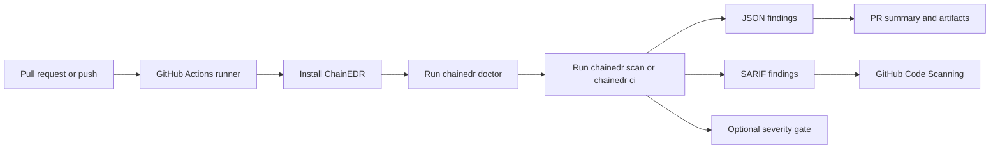

# ChainEDR — GitHub / CI Integration Guide

> Detailed reference for running ChainEDR in CI. For a quick start see the [main README](../README.md).
> ChainEDR ships a dedicated `chainedr ci` subcommand for JSON/SARIF artifacts and severity gates.

## Overview

ChainEDR Analyzer is a CI-first static scanner for Pectra-era smart-account assumptions. The GitHub integration turns every Solidity, Noir, Aztec, and account-abstraction change into reviewable findings, SARIF code-scanning alerts, JSON artifacts, and optional severity gates.

This repository contains the scanner, the GitHub Actions workflow, and a reusable composite action prototype. The integration is designed for two different operating modes:

- **Report-only mode** for research repositories, benchmark suites, and security-tool development.
- **Gate mode** for production smart-contract repositories where high or critical findings should block a pull request.

ChainEDR is not only a wrapper around existing analyzers. Its strongest direction is pre-execution analysis for modern Web3 execution models, especially EIP-7702 delegated accounts, ERC-7562 validation constraints, ERC-4337 account-abstraction flows, ZK verifier integration, Noir circuits, and Aztec.nr privacy contracts. Runtime monitoring belongs to the optional Monitor track; this guide focuses on the Analyzer.

## Why This Integration Exists

Most smart-contract security tools are run too late: after a manual audit starts, after a contest submission, or after a vulnerable pattern has already landed in the codebase. ChainEDR moves the first security review into GitHub:

1. A developer opens a pull request.
2. GitHub Actions installs ChainEDR and optional analyzers.
3. ChainEDR scans changed Solidity, Noir, and Aztec projects.
4. Findings are exported as JSON and SARIF.
5. GitHub Code Scanning shows alerts in the Security tab.
6. Pull requests can receive a summary comment.
7. CI can either stay report-only or fail on configured severity.

The result is a security feedback loop that is visible to developers, auditors, and researchers without requiring them to run the tool manually.

## Core Idea

ChainEDR treats GitHub as the control plane for smart-contract security work:



The scanner output is meant to be useful in three places:

- **Developer review:** concise findings, severity, location, and recommended fix.
- **Security operations:** SARIF alerts, historical artifacts, and CI policy gates.
- **Research work:** reproducible JSON/SARIF output for benchmarks, comparisons, and paper evaluation.

## What ChainEDR Adds To GitHub

### 1. CI-native smart-contract scanning

ChainEDR runs from a normal GitHub Actions workflow. It does not need a separate dashboard to produce value. A repository can start with a single workflow file and immediately get:

- command-line scan logs,
- `chainedr.json`,
- `chainedr.sarif`,
- downloadable report artifacts,
- GitHub Code Scanning alerts,
- optional pull-request comments,
- optional severity-based CI failure.

### 2. SARIF first-class output

SARIF is the format GitHub Code Scanning understands. ChainEDR writes SARIF 2.1.0 so findings can appear in GitHub's Security tab and code-scanning UI.

For this repository, SARIF upload is configured as non-blocking:

```yaml
continue-on-error: true
```

That is intentional. Scanner findings should not disappear just because GitHub Code Scanning permissions are not enabled yet.

### 3. JSON artifacts for research and automation

The JSON artifact is the source of truth for automation. It preserves detector names, rule IDs, severity, confidence, file locations, recommendations, and detector-specific metadata.

The current JSON shape is an object with a top-level `findings` array. The
stable report contract is documented in
[`schemas/chainedr-scan-report.schema.json`](../schemas/chainedr-scan-report.schema.json).
The reusable Action and PR-comment examples also tolerate the older flat-list
shape so existing artifacts remain parseable.

Each current finding includes `analysis_depth`, which lets CI, auditors, and
paper scripts distinguish regex/context checks, semantic-index-backed checks,
deep AST checks, external-tool findings, experimental checks, and dynamically
confirmed/refuted paths.

For EIP-7702 sandbox work, this includes fields such as:

- `standard`
- `erc7562_rule`
- `sandbox_boundary`
- `sandbox_bypass_class`
- `sandbox_policy`
- `pre_behavior_trace`

Those fields are important because they connect a code finding to a clear research claim: ChainEDR is not only saying "this pattern is suspicious"; it is explaining which sandbox boundary is violated and what delegated behavior makes the assumption unsafe.

### 4. Report-only and gate modes

Not every repository should fail CI when findings exist.

This ChainEDR repository intentionally contains vulnerable templates and benchmark contracts. For this repository, the workflow runs in report-only mode:

```bash
chainedr ci . --fail-on none --no-external --deep --json chainedr.json --sarif chainedr.sarif
```

For a production contract repository, gate the build on severity with the dedicated `ci` subcommand:

```bash
chainedr ci contracts/ --fail-on high --min-severity MEDIUM --json chainedr.json --sarif chainedr.sarif
```

This separation is one of the main integration advantages. Research repos can collect evidence; production repos can enforce policy.

## Main Strengths

### CI-first design

The v3 public command surface is built around GitHub-style workflows:

| Command | GitHub role |
| --- | --- |
| `chainedr scan` | Report-only scanner for local and workflow runs |
| `chainedr ci` | CI wrapper with SARIF, JSON, baseline diff, and severity gates |
| `chainedr prove` | Evidence mode for PoCs, reports, and benchmarks |
| `chainedr live` | Optional runtime/on-chain workflows, not the core Analyzer promise |
| `chainedr doctor` | Tool and environment health check |

### Modern Web3 coverage

ChainEDR is shaped around vulnerability classes that normal Solidity linters often miss or only partially cover:

- EIP-7702 delegated account assumptions,
- ERC-7562 validation-sandbox violations,
- ERC-4337 `UserOperation` validation mistakes,
- EIP-7702 authorization gas accounting,
- EntryPoint isolation mistakes,
- delegated sender identity confusion,
- codehash and simulation/execution drift,
- ZK verifier integration errors,
- Noir circuit misuse patterns,
- Aztec.nr private/public boundary risks,
- classic Solidity vulnerabilities and Slither-backed findings.

### EIP-7702 sandbox metadata

The EIP-7702 integration is especially important for research. ChainEDR maps findings to sandbox boundaries:

| Boundary | Meaning |
| --- | --- |
| `identity_boundary` | EOA identity must not be treated as proof of non-programmable behavior |
| `code_boundary` | Code-presence checks must not be the only EOA/contract boundary |
| `storage_boundary` | Delegated code must not assume isolated storage layout |
| `call_boundary` | Calls, callbacks, hooks, and delegatecalls must preserve trust boundaries |
| `validation_boundary` | Signature, nonce, and EntryPoint validation must bind to delegated-account semantics |
| `replay_boundary` | Delegation authorizations must bind chain, nonce, ordering, and domain context |
| `revocation_boundary` | Delegation should have an auditable revocation path |
| `gas_boundary` | Sponsored/delegated execution must bound gas and griefing impact |

This gives the GitHub integration research value: alerts can carry structured behavioral context instead of only a generic warning.

### Reproducible artifacts

Every workflow run can preserve:

- raw JSON findings,
- SARIF findings,
- PR comment summaries,
- benchmark outputs,
- evidence files generated through `chainedr prove`.

This matters for audits and paper writing because reviewers need reproducible inputs and outputs, not screenshots.

### Optional external analyzers

ChainEDR can run by itself, but GitHub workflows can also install external tools:

- Slither,
- Semgrep,
- solc through `solc-select`,
- later Mythril, Halmos, Echidna, Aderyn, Wake, or Foundry where needed.

External tools increase coverage, but they are not treated as mandatory for basic repository health. `chainedr doctor` reports what is available.

## Current Repository Workflow

This repository now has two workflow files with different jobs:

| Workflow | Role |
| --- | --- |
| `.github/workflows/chainedr-scan.yml` | Internal private-beta release smoke for this scanner repository. It validates syntax, runs the beta smoke script, publishes benchmark/evidence artifacts, and uploads SARIF when available. |
| `.github/workflows/chainedr.yml` | Drop-in adopter template and the output shape used by `chainedr ci init`. This is the workflow a friend or prototype contract repo should copy first. |

The internal smoke workflow runs on:

- pushes to `main`, `master`, or `analyzer`,
- pull requests,
- manual `workflow_dispatch`,
- a scheduled daily run.

The smoke workflow intentionally stays evidence-heavy. It builds the package,
runs the private-beta smoke script, copies JSON/SARIF outputs, runs benchmark
helpers, and uploads the release artifacts even when SARIF upload is unavailable.

For this repository, a successful run can still report many findings. That is expected because the repo contains intentionally vulnerable fixtures, templates, and benchmark contracts.

## Bundled Drop-in Workflow Template

The friend/prototype workflow is:

```text
.github/workflows/chainedr.yml
```

It is intentionally resilient:

```yaml
permissions:
  contents: read
  actions: read
  security-events: write
```

```yaml
- name: Run ChainEDR scan
  continue-on-error: true
  run: |
    chainedr ci "${{ steps.target.outputs.path }}" \
      --profile auditor \
      --out-dir chainedr-report \
      --no-external \
      --deep \
      --fail-on high
```

```yaml
- uses: github/codeql-action/upload-sarif@v4
  if: always() && hashFiles('chainedr-report/chainedr.sarif') != ''
  continue-on-error: true
  with:
    sarif_file: chainedr-report/chainedr.sarif
    category: chainedr
```

```yaml
- uses: actions/upload-artifact@v7
  if: always()
  with:
    name: chainedr-report
    path: chainedr-report/**
```

That shape matters for beta use. A high-severity finding should still produce a
downloadable auditor folder, a SARIF file for Code Scanning, an evidence bundle,
an executive summary, and a GitHub run summary. The workflow is report-friendly by default; remove
`continue-on-error: true` from the scan step only when the repository is ready
to block pull requests on the configured `--fail-on` severity.

To generate the same workflow in another repository:

```bash
chainedr ci init
```

For private development from this repository, the template installs `./src` when
`src/pyproject.toml` exists. In normal user repositories, it installs the
published `chainedr` package.

If a contract repository needs Git submodules, add checkout submodule options
after confirming `.gitmodules` is complete. The bundled beta template keeps
submodules off by default so a broken or partial submodule entry cannot prevent
ChainEDR from producing artifacts.

## Drop-in Workflow: Report-only Mode

Use this for:

- research repositories,
- benchmark repositories,
- audit experiments,
- repositories where findings should be reviewed but not block merges yet.

```yaml
name: ChainEDR Analyzer

on:
  pull_request:
    paths:
      - "**/*.sol"
      - "**/*.nr"
  push:
    branches: [main, master]
    paths:
      - "**/*.sol"
      - "**/*.nr"
      - "foundry.toml"
      - "remappings.txt"
  workflow_dispatch:

permissions:
  contents: read
  actions: read
  security-events: write
  pull-requests: write

jobs:
  chainedr:
    runs-on: ubuntu-latest
    timeout-minutes: 30
    steps:
      - uses: actions/checkout@v6

      - uses: actions/setup-python@v6
        with:
          python-version: "3.12"

      - name: Install ChainEDR Analyzer
        run: |
          pip install chainedr
          pip install slither-analyzer semgrep || true

      - name: Check tool health
        run: chainedr doctor

      - name: Run report-only scan
        run: chainedr ci . --fail-on none --deep --sarif chainedr.sarif --json chainedr.json

      - name: Upload SARIF
        if: always()
        uses: github/codeql-action/upload-sarif@v4
        continue-on-error: true
        with:
          sarif_file: chainedr.sarif
          category: chainedr

      - name: Upload artifacts
        if: always()
        uses: actions/upload-artifact@v7
        with:
          name: chainedr-report
          path: |
            chainedr.json
            chainedr.sarif
```

For private development on this repository, replace:

```bash
pip install chainedr
```

with:

```bash
pip install ./src
```

That ensures the workflow scans with the code from the current checkout.

## Drop-in Workflow: Gate Mode

Use this for production repositories where a pull request should fail when a serious finding appears.

```yaml
name: ChainEDR Analyzer Gate

on:
  pull_request:
    paths:
      - "**/*.sol"
      - "**/*.nr"
  workflow_dispatch:

permissions:
  contents: read
  security-events: write
  pull-requests: write

jobs:
  chainedr:
    runs-on: ubuntu-latest
    steps:
      - uses: actions/checkout@v6

      - uses: actions/setup-python@v6
        with:
          python-version: "3.12"

      - name: Install ChainEDR Analyzer
        run: pip install chainedr

      - name: Run gated scan
        run: |
          chainedr ci . \
            --fail-on high \
            --min-severity MEDIUM \
            --deep \
            --sarif chainedr.sarif \
            --json chainedr.json

      - name: Upload SARIF
        if: always()
        uses: github/codeql-action/upload-sarif@v4
        continue-on-error: true
        with:
          sarif_file: chainedr.sarif
          category: chainedr

      - name: Upload artifacts
        if: always()
        uses: actions/upload-artifact@v7
        with:
          name: chainedr-report
          path: |
            chainedr.json
            chainedr.sarif
```

Severity gate options:

| Gate | Behavior |
| --- | --- |
| `--fail-on critical` | Fail only when critical findings exist |
| `--fail-on high` | Fail on high or critical findings |
| `--fail-on medium` | Fail on medium, high, or critical findings |
| no `--fail-on` with `scan` | Report-only, exit success |

## Composite Action Prototype

The repository also contains a composite action:

```text
plugins/github-action/action.yml
```

It exposes these inputs:

| Input | Default | Purpose |
| --- | --- | --- |
| `contracts-path` | `.` | File or directory to scan |
| `min-severity` | `LOW` | Minimum severity to report |
| `fail-on` | `HIGH` | Severity gate for CI |
| `output-sarif` | `true` | Upload SARIF to GitHub Code Scanning |
| `deep` | `false` | Enable slower AST-assisted precision gates |
| `extended` | `false` | Enable experimental checks that are not yet fully FP-gated |

It emits these outputs:

| Output | Purpose |
| --- | --- |
| `findings-count` | Total number of findings in `chainedr.json` |
| `critical-count` | Number of critical findings |
| `high-count` | Number of high findings |
| `medium-count` | Number of medium findings |
| `sarif-path` | SARIF file path, usually `chainedr.sarif` |

Example usage after publishing the action:

```yaml
- name: ChainEDR Analyzer Scan
  uses: icedracon/chainedr-public/plugins/github-action@master
  with:
    contracts-path: contracts/
    min-severity: MEDIUM
    fail-on: HIGH
    deep: true
    output-sarif: true
```

For private or unreleased development, prefer the full workflow that installs `./src`. The composite action prefers the published `chainedr` package and falls back to this repository's `src/` package when used from the repo.

## GitHub Result Preview

The bundled template leaves three visible outputs in a GitHub run:

- a step summary with target path, total findings, and severity counts,
- Code Scanning alerts from `chainedr-report/chainedr.sarif` when the repository permits SARIF upload,
- a downloadable `chainedr-report` artifact containing `scan.json`, `chainedr.sarif`, `evidence_bundle.md`, `executive_summary.md`, and `manifest.json`.

The demo preview below is the checked-in visual asset used for reviewer-facing
documentation. Live private-repository screenshots are not committed, but the
same result shape appears in GitHub Actions and Code Scanning after the workflow
runs.



## Understanding The Results

### Workflow status

| Result | Meaning |
| --- | --- |
| Workflow success with findings | Normal in report-only mode |
| Workflow failure from `chainedr ci` | Severity gate was triggered |
| SARIF upload warning only | Usually permission or Code Scanning setup issue |
| Artifact uploaded | JSON/SARIF are available for inspection |

### Finding severity

| Severity | How to treat it |
| --- | --- |
| `CRITICAL` | Candidate merge blocker; needs manual confirmation or immediate fix |
| `HIGH` | Serious issue; usually blocks production PRs |
| `MEDIUM` | Review before merge; useful for audit backlog and hardening |
| `LOW` | Informational, maintainability, linter, or weak-signal issue |

### Detector families

Common detector families in JSON/SARIF:

| Detector | Meaning |
| --- | --- |
| `solidity` | General Solidity static analysis and Slither-style findings |
| `eip7702` | EIP-7702 delegated-account source assumptions |
| `eip7702_validation` | ERC-7562/EIP-7702 validation-sandbox checks |
| `noir` | Noir/Nargo circuit checks |
| `aztec` | Aztec.nr private/public boundary checks |

## EIP-7702 GitHub Value

The EIP-7702 work is where the GitHub integration becomes more than a normal scanner.

EIP-7702 allows an EOA to temporarily behave with delegated account code. That breaks old assumptions such as:

- `tx.origin == msg.sender` means a plain human EOA,
- `address.code.length == 0` means no executable behavior,
- validation code cannot be called outside the intended EntryPoint path,
- an authorization tuple is always single, unambiguous, and correctly priced,
- simulation and execution observe the same code state.

ChainEDR turns those assumptions into pre-execution findings. In GitHub, that means a PR can be reviewed for future delegated-account behavior before deployment.

Example metadata shape:

```json
{
  "rule_id": "AA7562-008",
  "detector": "eip7702_validation",
  "severity": "HIGH",
  "metadata": {
    "standard": "ERC-7562",
    "sandbox_boundary": "identity_boundary",
    "sandbox_bypass_class": "entrypoint_isolation_bypass",
    "erc7562_rule": "ERC-4337 EntryPoint isolation"
  }
}
```

This is useful for audit reports and research because the alert names the security boundary, the bypass class, and the standard relationship.

## Paper And Benchmark Integration

GitHub should also support the research path. For EIP-7702 sandbox work, the current microbenchmark is:

```text
benchmarks/eip7702_sandbox/
```

It currently labels examples for rules such as:

- forbidden validation environment reads,
- value transfer during validation,
- mutable external code identity,
- multiple EIP-7702 authorization tuples,
- delegated account used outside sender role,
- same-sender delegate mismatch,
- missing `userOpHash` binding,
- missing EntryPoint gate,
- missing EIP-7702 `PER_EMPTY_ACCOUNT_COST` accounting.

Recommended paper-grade GitHub workflow:

1. Store vulnerable, fixed, and benign samples in a labeled corpus.
2. Run ChainEDR in every pull request that changes the corpus or detector.
3. Upload JSON/SARIF artifacts.
4. Generate precision, recall, F1, false-positive rate, runtime, sandbox-boundary accuracy, and trace-coverage metrics.
5. Compare against baseline tools where applicable.
6. Preserve every result as an artifact for reproducibility.

Current full benchmark evaluator:

```bash
python scripts/benchmark_evaluator.py --strict \
  -o results/eip7702_benchmark_eval.json
```

Validation-sandbox metadata evaluator:

```bash
python scripts/evaluate_eip7702_sandbox.py --strict \
  -o results/eip7702_validation_eval.json
```

Minimum target before presenting the work as a serious paper artifact:

```text
300+ labeled samples
10+ vulnerable variants per detector family
10+ fixed or benign controls per detector family
fixed and benign controls for every rule family
comparison against Slither/Semgrep/Mythril where applicable
per-rule precision, recall, and F1
runtime measurements
ablation study with and without sandbox metadata
manual label review notes
```

## Security And Permission Model

The workflow should use only the permissions it needs:

```yaml
permissions:
  contents: read
  actions: read
  security-events: write
  pull-requests: write
```

Use cases:

- `contents: read` lets the runner check out the repository.
- `actions: read` helps GitHub actions and SARIF telemetry read run metadata.
- `security-events: write` lets SARIF upload create Code Scanning alerts.
- `pull-requests: write` is needed only if the workflow posts PR comments.

Do not add broad token permissions unless a workflow step needs them.

## Troubleshooting

### `Process completed with exit code 1`

This means the command failed. If the command was `chainedr ci`, the most common reason is a severity gate:

```bash
chainedr ci --fail-on high
```

For benchmark repositories, use report-only scan:

```bash
chainedr scan . --sarif chainedr.sarif --json chainedr.json
```

### `Resource not accessible by integration`

This usually means GitHub token permissions or Code Scanning access are not enough for SARIF upload.

Check:

- workflow has `security-events: write`,
- workflow has `actions: read`,
- repository allows GitHub Actions to create security events,
- Code Scanning is available for the repository,
- SARIF upload step has `continue-on-error: true` if alerts should not block CI.

### SARIF uploads but no alerts appear

Check:

- the SARIF file exists,
- the SARIF file is valid 2.1.0,
- `sarif_file` path matches the generated file,
- the repository has Code Scanning enabled,
- findings have file paths that exist in the checked-out repository.

### `chainedr doctor` reports missing tools

Missing external analyzers reduce coverage but should not break the core scanner. Install optional tools only when needed:

```bash
pip install slither-analyzer semgrep
pip install solc-select
solc-select install 0.8.28
solc-select use 0.8.28
```

### The ChainEDR repository reports many vulnerabilities

Expected. This repository includes intentionally vulnerable fixtures, templates, and benchmark contracts. Treat root scans here as scanner-validation output, not as a production audit result.

## Recommended Rollout Plan

### Phase 1: Report-only adoption

- Add workflow.
- Upload SARIF and JSON.
- Do not fail pull requests yet.
- Review alert quality and false positives.

### Phase 2: High-confidence gate

- Fail only on `CRITICAL`.
- Build an ignore/baseline policy.
- Review every blocking finding manually.

### Phase 3: Production policy

- Fail on `HIGH`.
- Require PR comments and artifacts.
- Keep benchmark regressions in CI.
- Use baseline diff mode so old debt does not block unrelated work.

### Phase 4: Research evidence

- Expand labeled corpus.
- Run comparison tools.
- Export metrics.
- Preserve artifacts for paper reproducibility.

## Current Pros

ChainEDR's GitHub integration is strongest when judged as a security-development system, not only as a scanner.

- It fits normal GitHub workflows.
- It supports both report-only and gate modes.
- It outputs SARIF for GitHub Code Scanning.
- It preserves JSON for research, automation, and reproducibility.
- It can scan Solidity, EIP-7702 patterns, Noir, and Aztec projects.
- It adds structured EIP-7702 sandbox metadata.
- It can run without external tools but benefits from Slither/Semgrep/solc.
- It supports a paper path through benchmarks and evidence artifacts.
- It is practical for CI today and extensible toward a GitHub App or commercial dashboard later.

## Roadmap

Near-term improvements:

- Expand EIP7702-Bench beyond the current 57 samples.
- Keep `labels.json` as the full benchmark source of truth and `manifest.json` as the AA7562 validation-metadata subset.
- Add per-rule precision/recall/F1 output to paper tables.
- Keep CI artifact upload for `results/eip7702_benchmark_eval.json` and `results/eip7702_validation_eval.json`.
- Add baseline-diff comments for pull requests.
- Improve PR comments with top findings and direct file links.
- Add official reusable action release tags.
- Publish a clean example repository for users.

Research improvements:

- Compare against Slither, Semgrep, Mythril, and custom rulesets.
- Add false-positive evaluation on benign ERC-4337 accounts.
- Add real-world account-abstraction case studies.
- Add ablation: normal findings vs sandbox-enriched findings.
- Export paper-ready tables from CI artifacts.

Product improvements:

- GitHub App installation flow.
- Organization-level dashboard.
- Per-repository policy profiles.
- Finding baseline management.
- Triage states and assignment workflow.
- Evidence bundle export for auditors and bounty reports.

## Quick Commands

Local install from this repository:

```powershell
python -m pip install -e .\src
chainedr doctor
```

Report-only scan (clean JSON artifact):

```powershell
chainedr scan . --no-external --json chainedr.json
```

Focused EIP-7702 scan on the benchmark corpus:

```powershell
chainedr scan .\benchmarks\eip7702_full\vulnerable --no-external --json eip7702_findings.json
```

Run the current GitHub workflow manually:

```text
GitHub -> Actions -> ChainEDR Analyzer -> Run workflow -> master
```

If GitHub CLI is installed:

```bash
gh workflow run chainedr-scan.yml --ref master
gh run list --workflow chainedr-scan.yml --limit 5
```

## Final Position

The integration goal is simple but serious: make ChainEDR Analyzer work where smart-contract teams already work. GitHub should show the finding, keep the evidence, preserve the artifact, and enforce the policy when the project is ready.

For normal repositories, this means safer pull requests.

For research, this means reproducible experiments.

For the EIP-7702 sandbox direction, this means ChainEDR can become more than a vulnerability scanner: it can become a pre-execution behavioral analysis framework for delegated-account security.
